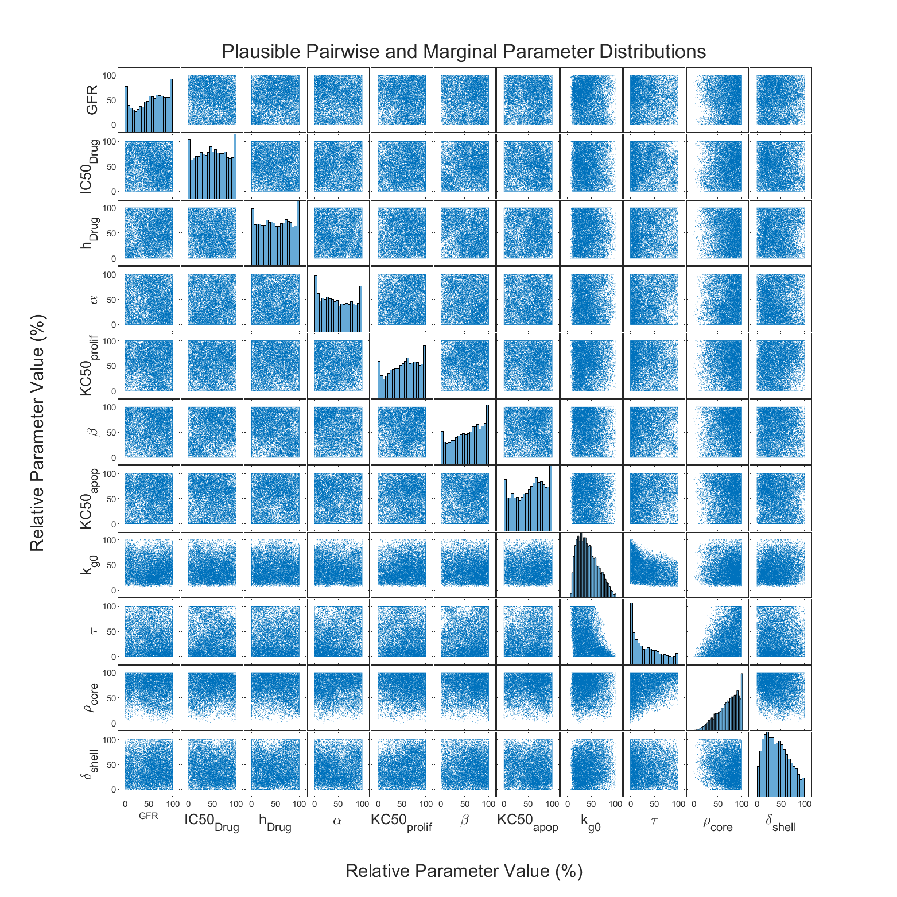
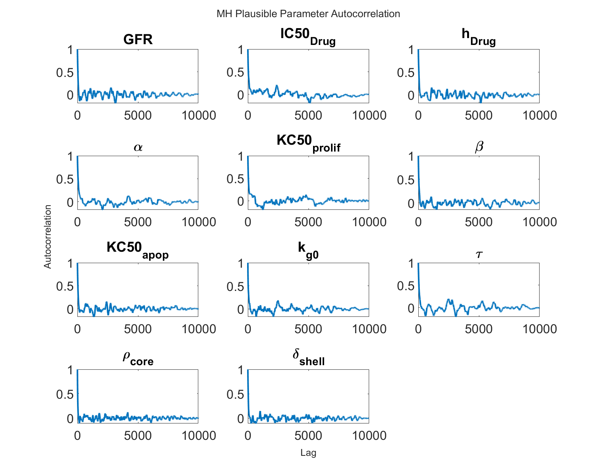
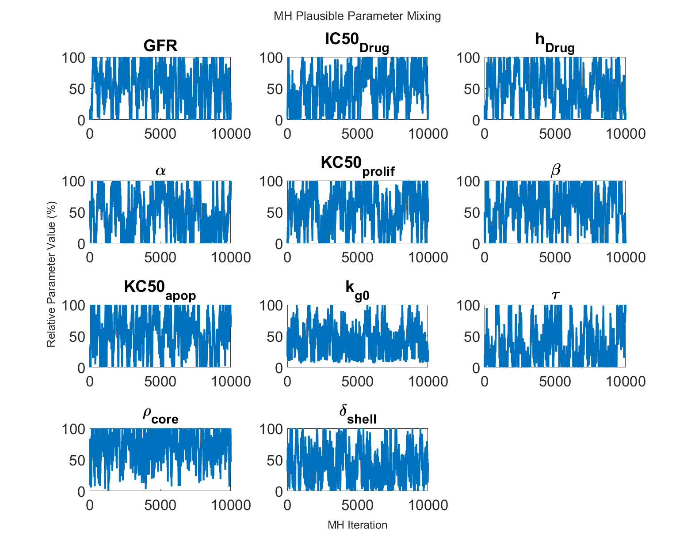
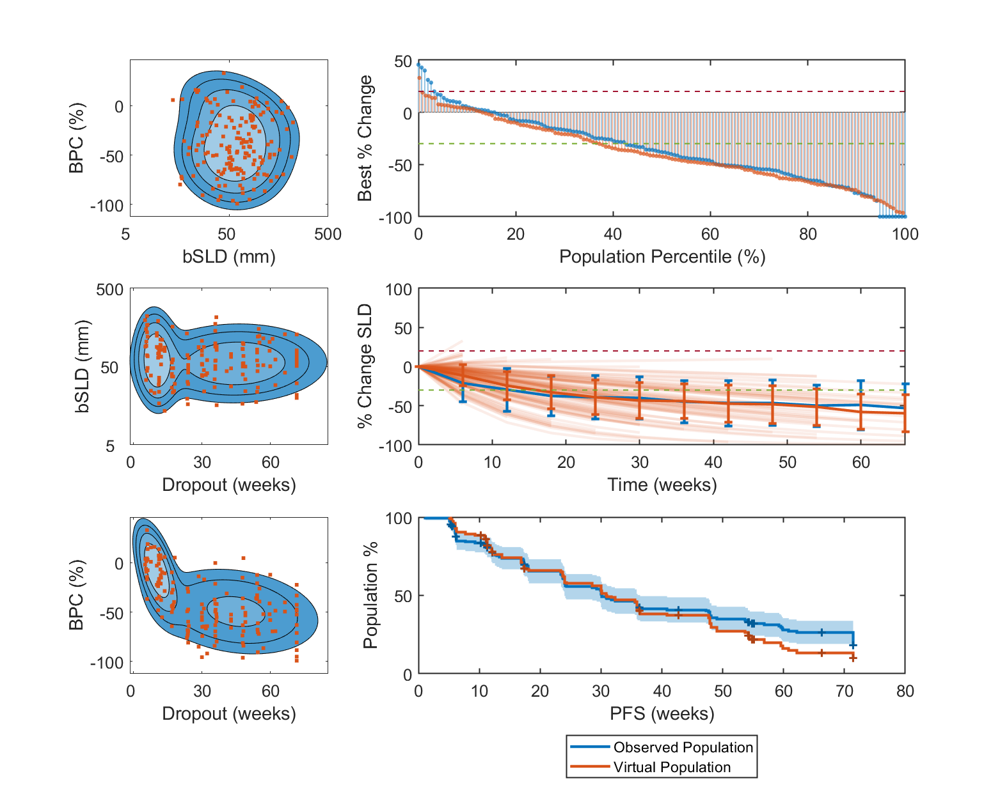
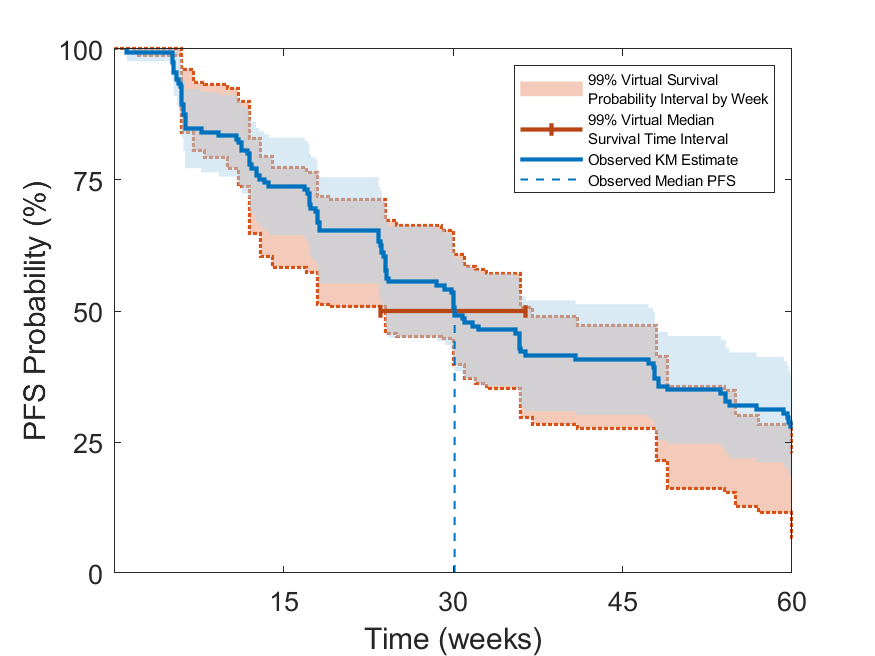
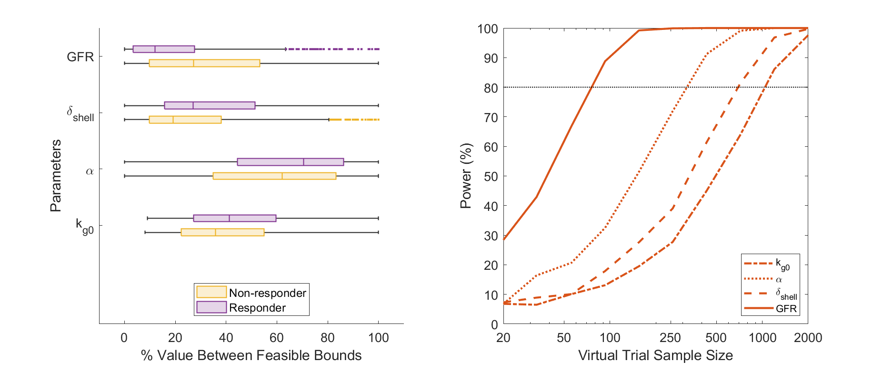

# Virtual Population Method for QSP Oncology Solid Tumor Models

## Getting Started

The paper analysis can be performed  using the paper_script.m
Matlab file. Synthetic data generated via model simulation has been
 provided to enable users to run the analysis.  

If the user desires to run the
code on a cluster, the run.m file can be used to call the paper script
(this acts as a wrapper as some job schedulers pass the quoted script 
contents in the command line Matlab call, which can cause issues). 

Before running the code in the repository the user must provide a set of 
csv/Excel files, outlined below, and update the path to those files in the 
paper_script.m file before running. Synthetic data files have been provided
to enable users to get started.

Each section of paper_script.m is described in more detail below. This
ReadMe also contains high-level descriptions of the functions used
to generate the paper figures and the functions of the core selection
algorithm.

## Summary of Required Data and Files for Running the Code

### pk_table.xlsx

An Excel file describing the median PK profile for the drug. This profile 
is a simulation of the median patient from the model described in 
Chen et al. 2021, cited in the main text manuscript as reference [24]. The first
column has header 'time' and contains the time in days listed from day 0 to
day 1180. In this work we used an increment of 0.2 days. The second column
has header 'Cc_Drug' and contains the drug concentration in nM at each 
corresponding time. The sheet name is 'Cc_Drug'.

### params.xlsx

An Excel file describing parameter names, nominal values, upper/lower bounds,
and a boolean indicating if the parameter is to be sampled in the Vpop. The
first column header is 'name' and consists of a string name for each
parameter in the model, not just those varied in the virtual populations. 
The second column has header 'value' and consists of the nominal value for 
each parameter in the model. Note, for parameters not varied in the Vpop, 
the nominal value will be used for simulations -- unless it is adjusted as 
part of initial condition sampling (i.e. k_el). The third column header is 
'isvariable' and consists of a boolean (0/1) column indicating a parameter should 
be varied in the virtual population if the value is 1. The fourth column 
header is 'lower_bnd' and contains the lower bound for each parameter value.
The fifth and final column header is 'upper_bnd' and contains the upper bound
for the parameter value. Note, nominal values are required for all 
non-varied parameters and bounds are required for all varied parameters 
within the Vpop.

### initial_conditions.xlsx

This Excel file specifies initial conditions for the model state variables as 
well as upper and lower bounds. The first column header is 'name' and the
column consists of string names for each model state variable. The second
column header is 'value' and the column consists of a numeric value for the
IC of each state variable. The third column header is 'isvariable' and
consists of a boolean (0/1) column indicating which initial conditions are
to be varied (along with parameters) in the virtual population. The fourth
and fifth column headers are 'lower_bnd' and 'upper_bnd' respectively and 
contain bounds for the varied initial conditions.

### synthetic_clinical_data.csv

This file contains synthetic clinical data which has been generated via
 simulation from the QSP model and virtual population selection procedure.
This synthetic dataset can be used to run the entire workflow and reproduce
 qualitatively similar results to those shown in the paper, and also serves to aid users
  in understanding the algorithm. The format is such that each row
corresponds to a simulated patient. The following columns are required:

* EEVALUMP -- dropout time for each patient
* BESTPCHG -- best percentage change in SLD from baseline for each patient
* SLD -- baseline SLD in mm for each patient
* WEEK0 -- % in SLD from baseline at week 0 (note this is zero for all)
* ...
* WEEK{N} -- %SLD at week N, there is one column for each scanning interval
* ...
* WEEK72 -- %SLD at week 72, the last scanning interval used in the paper
* EVENTNP_NEW -- a column indicating if dropout was due to a PFS event ('PFS EVENT') or censoring ('NO PFS _EVENT')

## Summary of Additional Files Supplied for Getting Started

### plausible_population_Jan_04_2024_19_38.mat

This file contains the data structures describing the plausible population of 10,000
 plausible patients generated via the MCMC procedure using the original clinical data (not disclosed).
 The provided Matlab program can be used to generate a new plausible population using
 the synthetic data provided however the original plausible file is included for reproducibility.
A pre-generated plausible population can also save time in some analyses as plausible
 generation can take on the order of 1 day compute time to generate.

### Scoring_Gaussian_mixture_fit.mat

This file is not needed to run the code, but is provided to aid with reproducibility
 of the original results. It consists of 'pd' which is a distribution object generated
 from fitgmdist(), 'mu' which is a matrix of means of the Gaussian components where
 each row is a component and each column a dimension, and 'sigma' which is a 
three-dimensional matrix where each slice along the third dimension indexes the
 covariance matrices for each component.  These objects define the two-component Gaussian mixture
 fitting results with respect to the available clinical data. The first dimension of the data is the log-transformed
baseline SLD, the second is the best percentage change in percent, and the third is
the dropout time in days.

### Vpop_Plotting.mat

This file contains saved data structures used to reproduce the exact simulation results shown in the
main text Figures 4-6. These include boolean vector 'vpop_inclusion_bool' which specifies the virtual
 population subset selected from the plausible population file, plausible_population_Jan_04_2024_19_38.mat,
 and 'subset_selected' which indicates which of 'vpop_inclusion_bool' has been selected via down sampling
 to be shown in Figure 4. Also included are cell arrays 'km_bootstrap_selected_list' and
 'power_analysis_weighted_samp_list' which contain a list of boolean vectors specifying the plausible
 patients in 'plausible_population_Jan_04_2024_19_38.mat' used in the bootstrap sampling in Figures 5 and 6.
 This file does not contain any clinical data and so cannot be used to regenerate the clinical plots in the paper,
 only the simulation results.

## Overview of the Main Paper Script (paper_script.m)

The following sections correspond to code blocks in the paper_script.m file
and include brief high-level descriptions of what each block does.
See comments in the script for more details.

### Flags

The following flags allow for high-level control of how the script functions:

'plot_only'
If set to true this will reproduce the exact paper figure simulation results, without the clinical data, from saved
 simulations in Vpop_Plotting.mat

'gen_plausibles'
If set to true this will re-generate a new set of plausible patients, 
otherwise they are loaded from the historical plausible population in plausible_population_Jan_04_2024_19_38.mat

'use_original_mixture'
If set to true the algorithm will use the original saved Gaussian mixture fit, Scoring_Gaussian_mixture_fit.mat,
 rather than re-fitting to new/synthetic clinical data. The original clinical data is not provided, only the fit distribution object.

'save_plots'
If set to true this will cause new plots to overwrite existing files.

### User Defined Settings

This code block allows the user to specify the file path to the required
csv/Excel files, along with some high-level settings for the plausible
populations generation. Users may need to update these paths prior to
running the code. Settings that can be specified here include trial length
and which clinical endpoints will be fit. By default the code will use
baseline SLD, best percent change (BOR), and dropout time (EEVALUMP) endpoints for scoring,
as done in the paper. 

### Initialization and Data Loading

This code block performs some essential data loading including reading the
drug PK table, the scanning times, the dropout times and censoring labels,
the parameter and initial condition files, and other necessary data. In the current
repository this section is set to read synthetic clinical data, generated via 
simulation. Note, some of these files are also loaded at other points in the code,
 due to modularity required in legacy versions of the program. 

### Selecting a Plausible Population

This block of code calls the mh_generate_pps.m which is the top-level function
for running the MH sampling of plausible patients. Selection can take on the
order of ~24hrs for 10,000 plausible patients. All return values are saved in a
time-stamped results file stored on the results_path (specified in the first
code block) with prefix 'output_root' (also specified in first block).

### Simulating a Plausible Population

This code block takes the selected plausible population and simulates the
specified trial, returning and saving the simulations in the 'store_sims' data
structure. The results file is updated to include 'store_sims' after completion.

### Loading an Existing Plausible Population (optional)

This code block is optional and can replace the previous two blocks if a 
plausible population has already been selected and simulated. This block
loads a pre-specified results file and populates the workspace with 
the data structures normally generated during plausible selection and simulation.

### Diagnostic Plots for MH Convergence and Coverage of Plausible Population (Figure S2-4)

This code block is used to generate diagnostic plots to assess MH mixing
and convergence for generation of the plausible population.
 These figures include i) a plot of scaled parameter values
(% of min-max range) vs MH iteration ii) a plot of lagged autocorrelation of each
parameter vs MH iteration iii) a pairwise scatter plot for all parameter pairs with
histograms of each parameter marginal distribution across the whole MH run.
These plots are included in the paper supplement.

This block generates the following figures (Supplementary FigS2-4):

### Sample a Virtual Population & Compute Probability of Inclusion

This code block uses the Allen/Rieger virtual population selection algorithm
to sample a virtual population from a plausible population. The algorithm
is implemented in get_vpop.m and is, for the most part, taken directly from the former
works. Note, the probability of inclusion is also returned from this algorithm.
This vector of weights is normalized here and used in the bootstrap resampling
for Figures 4 and 5.

### Down-sampling and Plotting a Virtual Population for Comparison to Data (Figure 4)

This code block down-samples the Vpop sampled via the Allen/Rieger algorithm to 
be the size of a specific trial (in this case that is 155 patients matching the Ph2 study cohort
used for selection). The sample is done without replacement and so the original
Vpop must be larger than the desired sample size. In the paper analysis,
with 10,000 plausible patients, the Allen/Rieger algorithm has historically selected on the order
of 400 virtual patients allowing for straightforward down-sampling to the 
desired size of 155. Following the down-sampling, the compare_plot.m function
is used to generate a comparison between the down-sampled virtual population
and the observed data. 

This code block generates the following figure (main text Fig. 4):

### Simulate Kaplan-Meier PFS Estimate via Vpop Bootstrap Resampling (Figure 5)

This block of code bootstrap resamples the plausible patients multiple times
to compute a KM confidence region and quantify uncertainty captured by the
Vpop sampling. The KM region is plotted against the analytically derived
confidence region from the observed data.

This generates the following figure (main text Fig. 5):

### Virtual Population Parameter Analysis (Figure 6)

This code block performs analyses on the inferred distribution of virtual
patient parameters. Two analyses are performed: i) parameters are ranked
on their association with responder status via a rank-sum test and a plot
visualizing top parameter distributions within responder categories is
created, and ii) top ranked parameters
from analysis (i) --- those with most significant relation to responder status --
are used in a power analysis assessing how large a sample size would be needed
to detect a significant difference in the parameter in a simulated trial.

This generates the following figure (main text Fig. 6):

## Overview of the Paper Analysis Plotting Functions 

These functions are used to implement the analysis and plots shown in 
the paper. The function definitions are located in the subfolder:
'PaperPlottingFunctions'. These functions can be used after a
plausible population has been selected and they  implement
specific plots or bootstrap-type analyses over the plausible population. 

### mh_diagnostic_plots.m

Generates MH diagnostic plots consisting of i) scaled parameter values
(% of min-max range) vs MH iteration ii) lagged autocorrelation of
parameter values iii) pairwise scatter plots for all parameters with
histograms of each parameter marginals. 

### downsample.m

Down-sample a virtual population (i.e. one selected via Allen/Rieger alg.)
into a specific sample size that must be smaller than the original
population. Uses equi-probability sampling. Assumes the virtual
population itself is specified as a boolean vector that is the same
length as the plausible population from which it was selected. This
function will select a subset of the true/non-zero elements from this
passed Vpop subset as specified in the boolean vector.

### compare_plot.m

This function plots a comparison between a selected virtual
population and the target clinical population used for selection (Figure 4).
These plots include visualizations showing the overlap between the
virtual population and the Gaussian mixture fit to the clinical data,
in each pair of dimensions of the score function. This function also 
plots comparisons of the waterfall plots of best percentage change, median SLD time series, and 
KM PFS estimates between the virtual population and the observed data. 
In the current repository only simulation results and comparisons with
the synthetic clinical data, generated from model simulation, can be
visualized as the original clinical data has not been disclosed.

### sim_km_bootstrap.m

Generates a plot comparing a bootstrap resampled uncertainty region for
KM estimate from the virtual population with the analytically derived
confidence region from the clinical data (Figure 5). In the current 
repository only simulation results and comparisons with
the synthetic clinical data, generated from model simulation, can be
visualized as the original clinical data is not been disclosed.

### responder_rank_params.m

This function creates a very large virtual population by resampling plausibles
according to their probability of inclusion, with replacement. The function then performs
rank-sum tests on this large population for each parameter comparing
responders (>-30% BPC) vs non-responders. The function plots top ranked parameters
in paired box plots to show quantiles of (non-)responders. (Fig. 6a)

### correlation_rank_params.m

Note, this function is no longer used in the paper analysis.
This function computes the pairwise Spearman correlation between every parameter
pair and selects the most correlated pairs (by absolute value) to show pairwise
scatter plots that are colored by responder status. 

### power_analysis.m

This function performs a power analysis across varying trial sizes
for the top parameters identified in the 'responder_rank_params' function. At each
sample size 1000 trials are simulated using sampling with replacement
from the plausible population. A rank-sum test is performed between
responders and non-responders for each top parameter value in each trial. The fraction of
signification results across the set of trials is used to compute
the expected statistical power for the given sample size. This is
used to generate a power analysis plot (Fig. 5b)

### subsamp.m

A helper function to sample, with replacement, a specific number of 
plausible patients according to the probability given in the probability-of-inclusion 
weight vector.

## Overview of Core MH Selection Algorithm Functions

These functions are located in the main/top-level folder and are the core
functions used in the plausible population generation and selection algorithm.
Together they implement the MH sampling scheme for plausible patient generation
and dropout/censoring assignment.

### load_pk_table.m

This function loads a pk table from pk_table.xlsx and formats it
appropriately so that is can be used for PK interpolation in the clinical
ODE function simulation. A single median PK is used for all subjects in
the virtual population.

### get_distribution_from_data.m

This function fits a Gaussian mixture model to the clinical endpoints
that will be used for scoring the plausible and virtual populations. This
function includes the option to log transform the data, allowing for fits to a mixture
of normal and log-normal distributed data. This function also includes code
to optionally plot the Gaussian mixture fit alongside the clinical data
to assess the fit quality.

### mh_generate_pps.m

This function implements the core Metropolis Hasting algorithm for
sampling plausible patients. This includes the top-level iterative loop
for proposing, simulating and scoring candidate plausible patients, as well as the
dropout and censoring assignment mechanism.

### get_p_and_state_bnds.m

This function formulates the lower and upper bounds on the fitting parameters and
states of the model. This function is entirely model dependent and must
be modified for each individual model.

### adjust_initial_conditions_and_parameters.m

This function adjusts the initial conditions after new parameters
have been proposed. Adjustments enforce several constraints on the
shell-and-core model and randomizes initial conditions subject to
certain assumptions (i.e. necrotic compartments all have same IC).
This function will also adjust k_el after IC's have been set.

### simulate_clinical_dosing.m

This function simulates the clinical ODE model with the loaded PK table
and processes the simulation output using
'process_model_parameters_and_states'. Simulation processing also performs
constraint checks on each simulation.

### mh_score_model.m

This function computes the MH score for a model simulation with respect
to the Gaussian mixture fit to the clinical data. As part of computing
the score, a constraint check is performed, violations of which results in
a score of zero.

### clinical_ODE.m

This functions implements the model ODE, returning time derivatives for
the passed state vector and time. The simulation time is used to
interpolate the PK and compute the instantaneous drug concentration.

### jacobian_pattern.m

This function returns the Jacobian pattern for the clinical ODE, for use
in simulating the ODE with ode15s().

### process_model_parameters_and_states.m

This function processes the output of the ODE simulation of the data and
computes clinically relevant outputs like BPC, pSLD etc for each simulated
 patient. If a PFS/dropout time is passed, endpoints will be computed with
  the specified time value provided.

### get_vpop.m

This function implements the Allen/Rieger virtual population selection
algorithm for generating a virtual population from an existing plausible
population.

